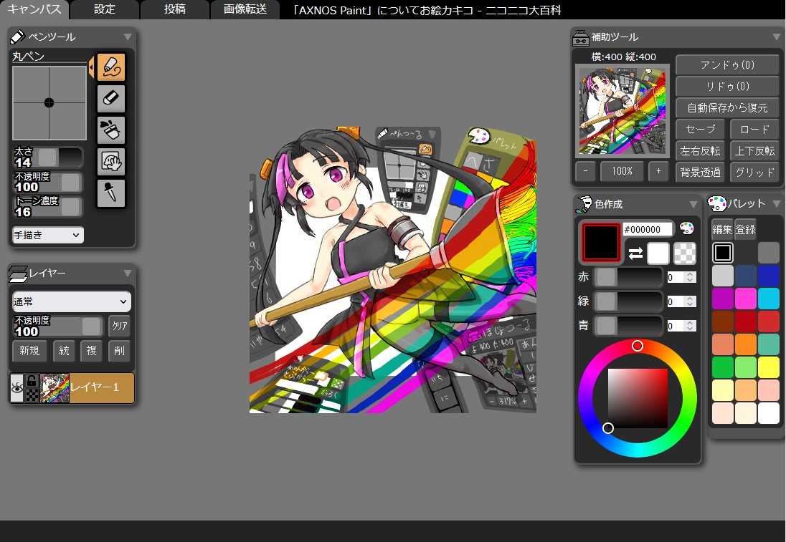
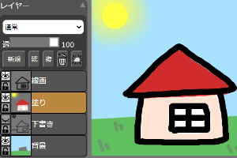
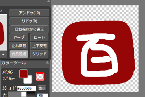
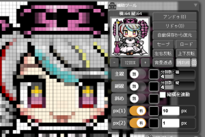
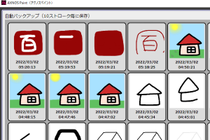
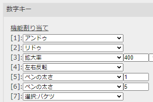
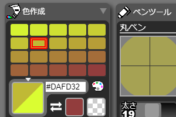
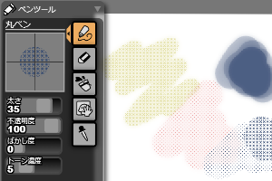

# AXNOS Paint

AXNOS Paint（アクノスペイント）は「お絵かき掲示板サイト」での利用を想定したペイントツールのオープンソースライブラリです。

 

# 特徴
機能を「お絵かき」でよく使われるものだけに限定しており、「レタッチ」系の機能は意図的に排除しています。
これにより、お絵かき初心者の方、初見の方でも操作に迷うことなく扱うことができるシンプルなお絵かき環境を提供します。

# お試しデモ version 1.99.66[2024/01/10版]
* Edge, Safari, Chrome, Firefox, Opera いずれかの最新版）で動作します
* スマートフォンには対応していません
* 投稿タブを開くことはできますが、実際に投稿を行うことはできません

    <form action="demo-2.0.0/index.html" method="get" target=”_blank”>
        

            <label>お絵カキコのサイズ:</label>
            <label>横</label>
            <input name="oekaki_width" type="number" maxlength="3" min="8" max="600" value="317" size="5">
            <label>縦</label>
            <input name="oekaki_height" type="number" maxlength="3" min="8" max="600" value="317" size="5">
        

        <button class="t_button" type="submit">お絵カキコする</button> 
    </form>

# 提供する機能

## レイヤー
最大８枚までのレイヤーを作成し、下書き、線画、色塗りなどに使い分けることができます。

乗算などの合成モードの他、透明部分のロックやクリッピングを使った簡易的なマスク機能を使用することができます。

## 透明色の使用/背景透過画像の作成
補助ツールの「背景透過」ボタンで白地と透過が切り替わります。透過状態の画素は灰色の市松模様として表示され、透過色を意識した描画が可能になります。

※透過画像を投稿するには、投稿先のシステムが透過画像に対応している必要があります。

## ドットペン/ドット単位の補助線
ドット単位で点が打てるドット専用ペンと、カスタマイズ可能な補助線を用意。ドット単位のグリッド線も表示可能です。

キャンバス全体のアンチエイリアシングのON/OFFを切り替えることができるため、ドットがぼやけてしまう心配もありません。

## 自動バックアップ
10ストローク毎に画像情報を自動的にバックアップします。不慮の事故でブラウザが強制終了してしまっても、直近の状態に復元することができます。

この他に、任意にセーブ／ロードができるスロットが５つまで使用できます。

## キーカスタマイズ
キーボードの数字キーに自由に機能を割り当てたり、マウスの右ボタンにアンドゥを割り当てるといったカスタマイズに対応しています。

## 混色パレット（オプション）
メインカラーとサブカラーを段階的に混ぜ合わせたカラーパレットを自動作成し、描画色として使用することができます。

※機能を使用するには、色作成の設定で有効化が必要です。

## ぼかし/トーン（オプション）
描画する線にぼかしをかけたりトーン効果を加えることができます。

※機能を使用するには、ペンツールの設定で有効化が必要です。

# 開発コミュニティ

## ニコニコミュニティ
* [「悪の巣」部屋番号13番：「趣味の悪い大衆酒場[Mad end dance hall]」](https://com.nicovideo.jp/community/co1128854)

## GitHub
* [https://github.com/axnospaint/axnospaint-lib/](https://github.com/axnospaint/axnospaint-lib/)

## 免責事項
* AXNOS Paintを利用することで何らかの損害が発生したとしても、コミュニティは一切の責任を負うことはできません。自己責任でのご利用をお願いします。

<small>
    AXNOS Paint &copy; 2022<a href="https://com.nicovideo.jp/community/co1128854" target="_blank"
        style="text-decoration: none;color:#222;">
        「悪の巣」部屋番号13番：「趣味の悪い大衆酒場[Mad end dance hall]」</a>
</small>

